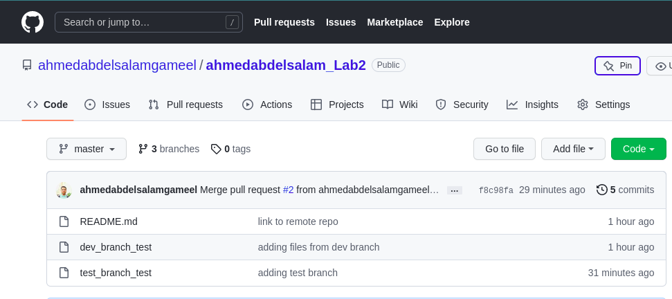

> Tell me how to remove dev branch locally and remotely?

>>  to remove dev branch locally " git branch -d dev "
>>  to remote dev branch remotly " git push origin :dev  "
<<<<<<<<<<<<<<<<<<<<<<<<<<<<<<>>>>>>>>>>>>>>>>>>>>>>>>>>>>>>
>Tel me How to list tags ?

>> git tag
<<<<<<<<<<<<<<<<<<<<<<<<<<<<<<>>>>>>>>>>>>>>>>>>>>>>>>>>>>>>
Tell me how to delete tag locally and remotely?

>> to delete tag locally " git tag -d tag_name "
>> to delete tag remotly " git push origin --delete tag_name "
<<<<<<<<<<<<<<<<<<<<<<<<<<<<<<>>>>>>>>>>>>>>>>>>>>>>>>>>>>>>
